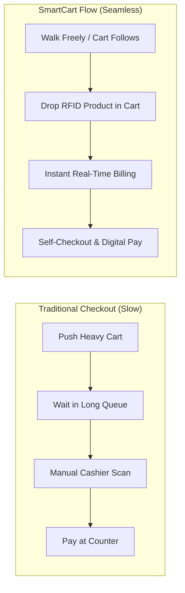
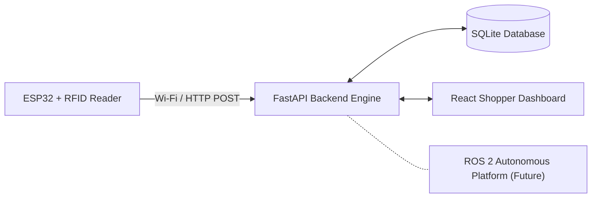

# SmartCart 🛒
> **Human-Following Smart Shopping Cart with Autonomous Billing**
> 
> *Follow. Shop. Pay. Go.*

SmartCart is an intelligent shopping assistance platform that eliminates checkout queues by combining **RFID product identification**, **real-time backend billing**, **interactive web dashboard**, and **future ROS 2-based autonomous cart navigation**.

---

## 🚀 Quick Visual Comparison



---

## ✨ Key Features

- **⚡ RFID-Based Product Identification**: Instant product lookup using 13.56 MHz RFID tags & ESP32.
- **📊 Real-Time Digital Cart**: Dynamic cart total calculations and session tracking.
- **💳 Autonomous Billing & Checkout**: One-click checkout generating transaction IDs and digital receipts.
- **🖥️ Shopper Dashboard**: React + Vite responsive UI for live cart visibility.
- **🤖 Decoupled Robotics Integration**: Modular API interface designed for future ROS 2 autonomous navigation.

---

## 🏗️ High-Level System Architecture

SmartCart uses a modular, decoupled architecture where telemetry acquisition (ESP32) is isolated from business and billing logic (FastAPI).



> 📖 **Deep Dive Documentation**: For detailed ER diagrams, sequence flows, hardware pinouts, state machines, and ROS 2 integration specs, see [docs/ARCHITECTURE.md](docs/ARCHITECTURE.md).

---

## 🛠️ Technology Stack

| Domain | Technology | Purpose |
| :--- | :--- | :--- |
| **Backend** | Python 3.10+, FastAPI, Uvicorn | REST API & Core Billing Engine |
| **Database** | SQLite, SQLAlchemy ORM | Relational Data & Transaction Storage |
| **Frontend** | React, Vite, JavaScript, CSS3 | Live Shopper UI Dashboard |
| **Embedded Hardware** | ESP32, MFRC522 (13.56 MHz) | RFID Tag Telemetry |
| **Future Robotics** | ROS 2, LiDAR, Depth Camera | Human Following & Autonomous SLAM |

---

## 📂 Repository Structure

```
smartcart/
├── README.md                 # Project Overview & Quickstart
├── backend/                  # FastAPI Application
│   ├── app/
│   │   ├── api/              # API Endpoints (products, cart, transactions)
│   │   ├── models/           # SQLAlchemy Data Models
│   │   ├── services/         # Billing & RFID Processing Services
│   │   └── database/         # Database Engine & Connection
│   ├── tests/                # Automated Test Suite
│   └── requirements.txt      # Python Dependencies
├── frontend/                 # React + Vite Web Dashboard
│   ├── src/                  # Components & State Management
│   └── package.json
├── hardware/                 # ESP32 Firmware & Wiring Diagrams
│   └── esp32/rfid_reader/    # Arduino / ESP-IDF C++ Sketch
└── docs/                     # Technical Specifications
    └── ARCHITECTURE.md       # Comprehensive Architecture & Flow Diagrams
```

---

## ⚡ Quick Start & Local Setup

### 1. Prerequisites
- Python 3.10+
- Node.js 18+ & npm
- Git

### 2. Backend Setup
```bash
# Clone the repository
git clone https://github.com/SaiAmirthesh/smartcart.git
cd smartcart/backend

# Create & activate virtual environment
python3 -m venv .venv
source .venv/bin/activate  # On Windows use: .venv\Scripts\activate

# Install dependencies
pip install -r requirements.txt

# Start the FastAPI server
uvicorn app.main:app --reload
```
- **API Server**: `http://127.0.0.1:8000`
- **Interactive Swagger Docs**: `http://127.0.0.1:8000/docs`

### 3. Frontend Setup
```bash
cd ../frontend

# Install dependencies
npm install

# Start Vite dev server
npm run dev
```
- **Shopper UI**: `http://localhost:5173`

---

## 🗺️ Development Roadmap & Status

| Phase | Description | Status |
| :---: | :--- | :---: |
| **Phase 1** | Backend Setup, Database & Product API | `COMPLETE` |
| **Phase 2** | Cart Session Engine & Checkout Transactions | `COMPLETE` |
| **Phase 3** | React/Vite Shopper UI Dashboard | `IN PROGRESS` |
| **Phase 4** | ESP32 Hardware Integration & RFID Reader | `PLANNED` |
| **Phase 5** | Digital Payment Integration & Receipt Generation | `PLANNED` |
| **Phase 6** | End-to-End System Testing & Fraud Verification | `PLANNED` |
| **Phase 7** | ROS 2 Autonomous Cart Integration & Human Tracking | `FUTURE` |

---

## 👥 Team & Domain Division

- **AI & Autonomous Navigation**: Human detection, tracking, LiDAR SLAM, ROS 2 integration.
- **Backend & Autonomous Billing**: FastAPI architecture, database design, billing engine, transaction security.
- **Embedded Systems & Integration**: ESP32 firmware, RFID hardware interfacing, network communication, hardware testing.

---

## 📄 License & Vision

SmartCart is built to transform the retail supermarket experience: **Follow. Shop. Pay. Go.**