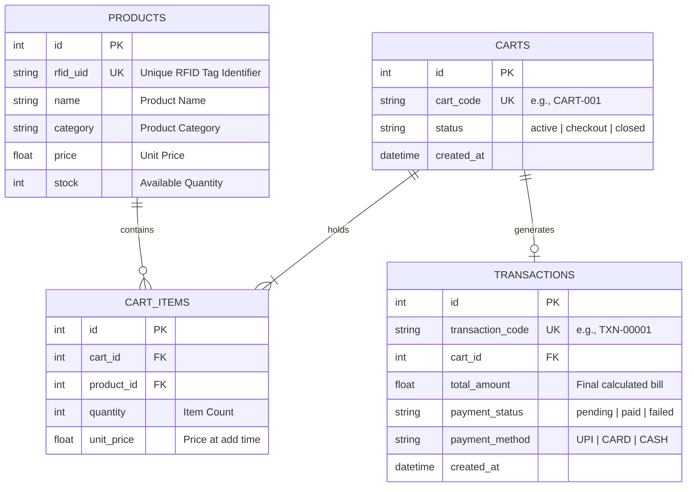
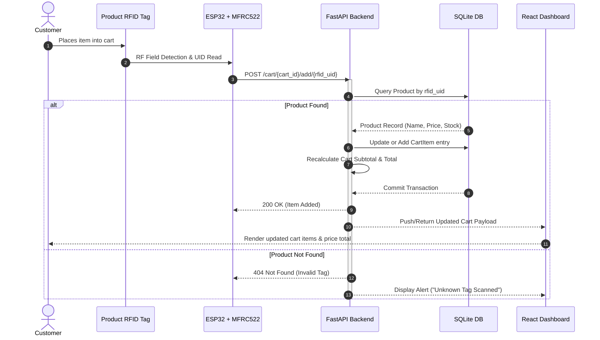
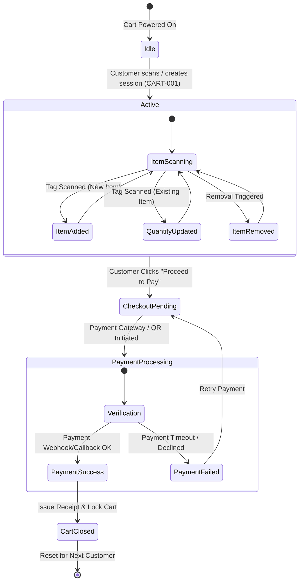
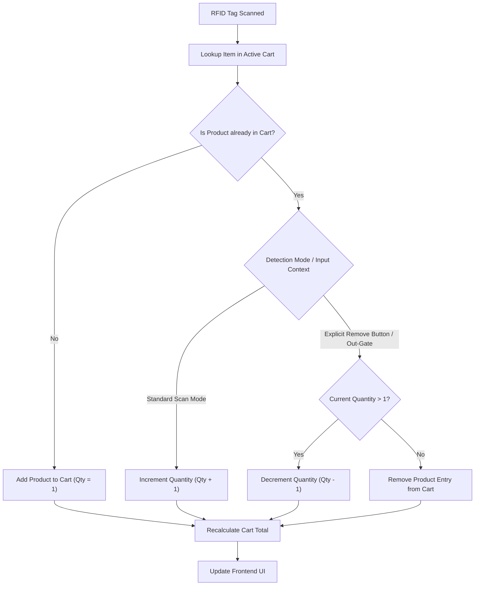
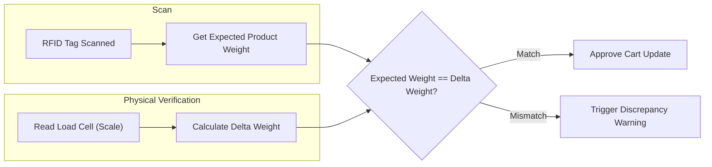
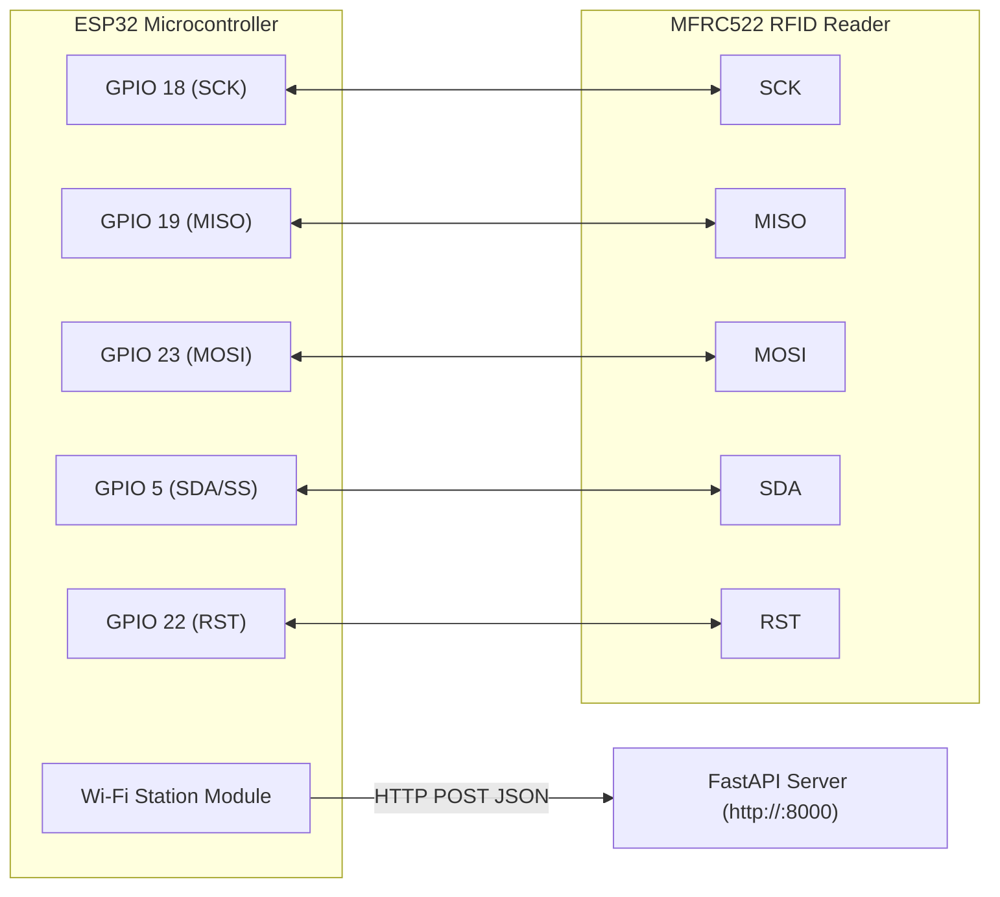
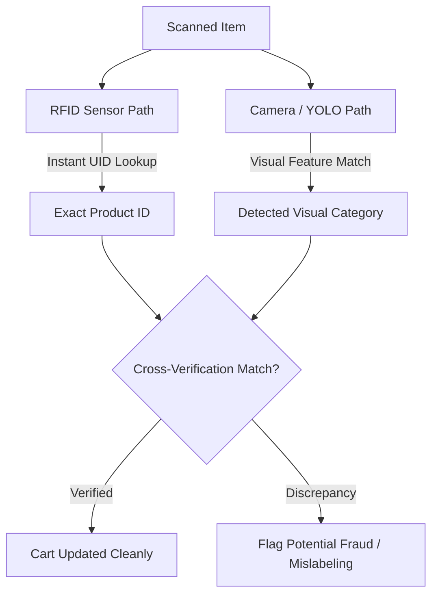
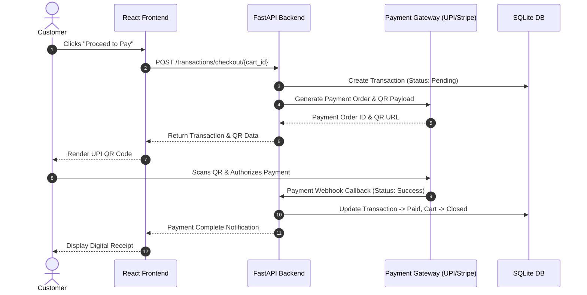
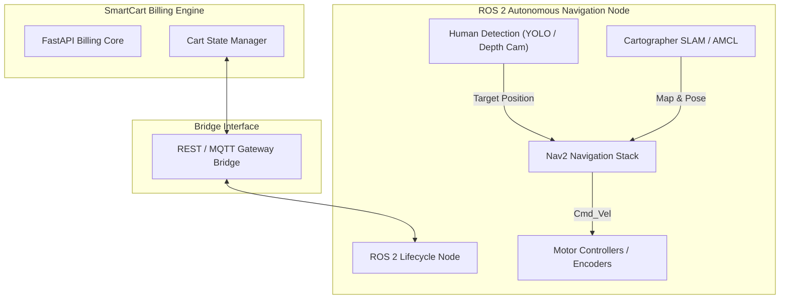

# SmartCart System Architecture

SmartCart is an intelligent shopping cart platform engineered to modernize retail checkout by combining **RFID product identification**, **real-time backend billing**, **interactive shopper web interface**, and **future ROS 2-based autonomous human-following robotics**.

This document outlines the system architecture, data models, state workflows, hardware interfaces, and integration boundaries.

---

## 1. System Architecture Overview

SmartCart is structured as a decoupled multi-tier architecture separating hardware sensor acquisition, core business and billing logic, data storage, interactive user interfaces, and external robotic navigation nodes.

```mermaid
flowchart TB
    subgraph Hardware["Hardware Subsystem (Shopping Cart)"]
        TAG["RFID Tag (Product)"]
        READER["MFRC522 RFID Reader"]
        ESP["ESP32 Microcontroller"]
        LOADCELL["Load Cell / Weight Sensor (Future)"]
        
        TAG -->|13.56 MHz High Frequency| READER
        READER -->|SPI Interface| ESP
        LOADCELL -.->|ADC / HX711| ESP
    end

    subgraph Transport["Network & Communication"]
        WIFI["Wi-Fi / REST API (HTTP)"]
        ESP -->|POST /cart/{id}/add/{uid}| WIFI
    end

    subgraph Backend["Backend Subsystem (FastAPI)"]
        API["FastAPI Routing Layer"]
        PROD_API["Product API"]
        CART_API["Cart API"]
        TXN_API["Transaction API"]
        
        BILL_ENG["Billing Engine"]
        RFID_SVC["RFID Service"]
        PAY_SVC["Payment Service"]
        
        DB[("SQLite Database / SQLAlchemy ORM")]
        
        WIFI --> API
        API --> PROD_API & CART_API & TXN_API
        PROD_API & CART_API & TXN_API --> RFID_SVC & BILL_ENG & PAY_SVC
        RFID_SVC & BILL_ENG & PAY_SVC <--> DB
    end

    subgraph Presentation["Shopper Dashboard (React Frontend)"]
        UI["React + Vite UI"]
        CART_VIEW["Real-Time Cart Display"]
        BILL_VIEW["Live Billing Summary"]
        PAY_VIEW["Checkout & QR Payment"]
        
        UI --> CART_VIEW & BILL_VIEW & PAY_VIEW
        API <-->|REST / Polling / WebSocket| UI
    end

    subgraph Robotics["Autonomous Navigation Subsystem (Future)"]
        ROS["ROS 2 Navigation Stack"]
        HUMAN_TRACK["Human Following (LIDAR / Camera)"]
        
        ROS <-->|Async API / Telemetry| API
        HUMAN_TRACK --> ROS
    end
```

### Core Design Principle: Hardware-Logic Separation
The **ESP32 microcontroller is stateless** with respect to billing logic. Its sole responsibility is telemetry collection (reading RFID UIDs and pushing payload to the REST backend). All product mapping, cart state, item quantities, total calculation, discount application, and payment processing reside exclusively within the backend.

---

## 2. Software Architecture & Directory Layout

The backend adopts a clean modular layered structure using FastAPI and SQLAlchemy:

```mermaid
graph TD
    subgraph Backend Modules
        MAIN["main.py (App Entry point & Middleware)"]
        
        subgraph API Layer ["app/api/"]
            P_API["products.py"]
            C_API["cart.py"]
            T_API["transactions.py"]
            PAY_API["payment.py"]
        end
        
        subgraph Service Layer ["app/services/"]
            R_SVC["rfid_service.py"]
            B_SVC["billing_service.py"]
            P_SVC["payment_service.py"]
        end
        
        subgraph Models Layer ["app/models/"]
            P_MOD["product.py"]
            C_MOD["cart.py"]
            T_MOD["transaction.py"]
        end
        
        subgraph DB Layer ["app/database/"]
            DB_CONN["database.py (Engine & Session)"]
        end
    end

    MAIN --> API Layer
    API Layer --> Service Layer
    Service Layer --> Models Layer
    Service Layer --> DB Layer
    Models Layer --> DB Layer
```

---

## 3. Database Architecture & Schema (ERD)

SmartCart utilizes relational storage via SQLite (expandable to PostgreSQL) managed by SQLAlchemy ORM.



---

## 4. End-to-End Billing & Cart Workflows

### 4.1 Product Scanning & Cart Update Sequence



### 4.2 Cart Session Lifecycle State Machine



---

## 5. Product Item Removal & Discrepancy Logic

Handling item removal in an RFID-enabled cart requires distinguishing intentional item removal from duplicate scans.



### Future Verification: RFID + Load Cell (Weight Matching)



---

## 6. Hardware Integration Architecture

The hardware prototype relies on an **ESP32 microcontroller** communicating with an **MFRC522 RFID module** over SPI.



### Telemetry Payload Schema (ESP32 $\rightarrow$ Backend)
```json
{
  "cart_code": "CART-001",
  "rfid_uid": "E200001",
  "timestamp": "2026-09-02T21:26:00Z"
}
```

---

## 7. Trade-off Analysis: RFID vs. Computer Vision (YOLO)

To ensure high accuracy during initial deployment, RFID was selected over vision-based tracking. However, future releases support a **hybrid verification model**.



| Metric / Dimension | RFID Approach (Current) | Computer Vision / YOLO (Future) |
| :--- | :--- | :--- |
| **Identification Accuracy** | 99.9% (Exact UID Match) | 85 - 95% (Subject to occlusion & lighting) |
| **Processing Overhead** | Very Low (< 10ms on ESP32) | High (Requires GPU / Edge NPU like Jetson) |
| **Catalog Scalability** | Infinite (1:1 Tag mapping) | Requires re-training model for new packaging |
| **Implementation Cost** | Low (~$5 per cart reader) | Moderate-High (Camera + Edge Compute unit) |
| **Role in SmartCart** | **Primary Identification Technology** | **Secondary Anti-Theft Verification Layer** |

---

## 8. Digital Payment Gateway Integration



---

## 9. Future ROS 2 Autonomous Robotics Interface

The shopping cart frame can be mounted on a differential drive mobile robot platform operating under ROS 2. The billing subsystem remains entirely decoupled, communicating with the ROS 2 navigation stack over lightweight network topics/APIs.



### Communication Contract
- **Billing $\rightarrow$ Robot**: Notify robot when cart session starts or checkout completes (e.g. stop following customer during payment).
- **Robot $\rightarrow$ Billing**: Send cart battery level, current aisle location, or obstruction alerts to shopper UI.

